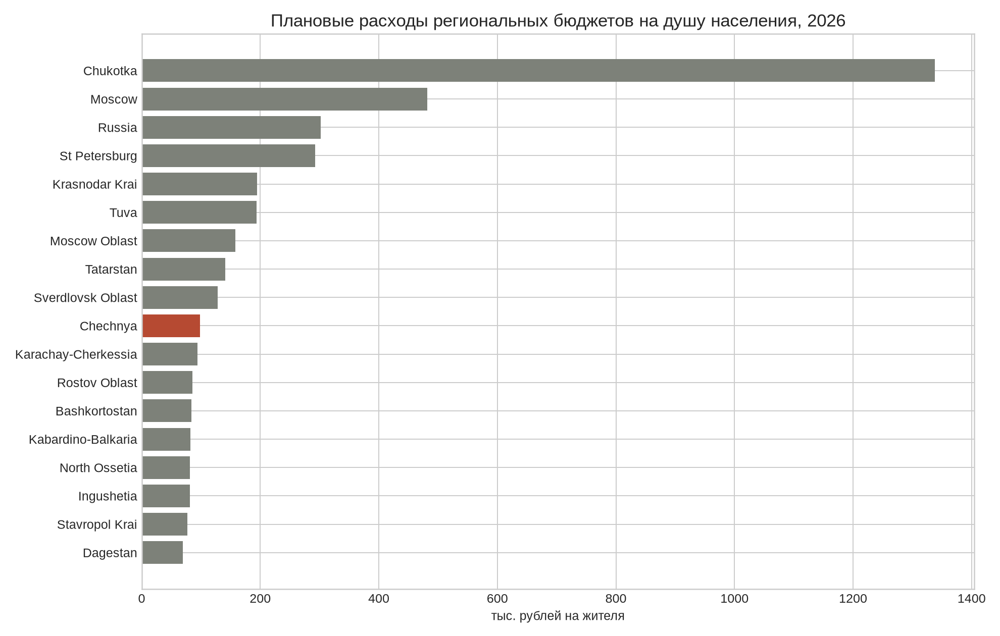
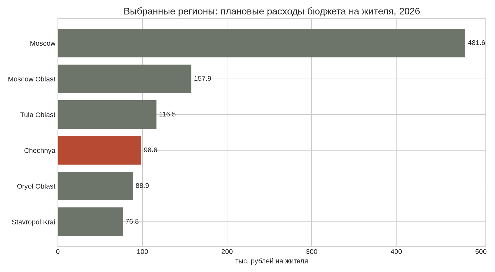

# Бюджеты Чечни и регионов России: сопоставительный анализ

**Дата среза:** 17 августа 2026 года. **Автор:** Manus AI.  
**Важно:** это статистический анализ, а не финансовая рекомендация или политическое заключение. Цифры относятся к бюджетам публичного сектора, а не к суммам, которые автоматически должны выплачиваться каждому жителю.

## Краткий вывод

В планах на 2026 год расходы консолидированного бюджета Чеченской Республики составляют **155,4 млрд руб.**, или **98,6 тыс. руб. на жителя**. Это ниже среднего показателя по России — **301,8 тыс. руб. на жителя**, примерно в **3,1 раза**, и ниже Москвы — **481,6 тыс. руб.** Внутри Северо-Кавказского федерального округа Чечня не является лидером: выше показатель в Туве, Дагестане — ниже, а Ингушетия, Кабардино-Балкария, Северная Осетия и Ставропольский край находятся близко или ниже.

Однако Чечня сильно зависит от федеральных трансфертов. В публикации Минфина ЧР по измененному бюджету 2024 года безвозмездные поступления составляли **110,6 млрд руб. из 134,2 млрд руб. доходов**, то есть около **82,4%** плановых доходов регионального бюджета [1]. Это указывает не на «завышенный» расход на одного жителя относительно России, а на **высокую зависимость доходной части от федерального перераспределения**.

## 1. Что именно сравнивается

Для сравнения на 2026 год использованы плановые доходы и расходы бюджетов субъектов, население и расходы на душу населения из сводной таблицы журнала «Бюджет» [2]. Для исторической динамики Чечни использованы данные Чеченстата по **исполнению консолидированного бюджета** за 2005, 2010, 2015, 2019–2024 годы [3].

Это не полностью одинаковые сущности: «республиканский бюджет» Чечни и «консолидированный бюджет» субъекта включают разные уровни и периоды учета. Поэтому показатели Минфина ЧР за 2024 год нельзя механически складывать с рядом Чеченстата; расхождение является ожидаемым результатом разной базы сравнения и стадии исполнения.

| Показатель | Чечня, 2026 | Россия, 2026 | Соотношение Чечни к России |
|---|---:|---:|---:|
| Доходы бюджета | 148,6 млрд руб. | 40 283,3 млрд руб. | 0,37% |
| Расходы бюджета | 155,4 млрд руб. | 44 069,7 млрд руб. | 0,35% |
| Население | 1,576 млн | 146,028 млн | 1,08% |
| Расходы на жителя | 98,6 тыс. руб. | 301,8 тыс. руб. | 32,7% |
| Плановый дефицит | 6,8 млрд руб. | 3 786,4 млрд руб. | — |

В абсолютных суммах Москва, Санкт-Петербург, Московская область и крупнейшие промышленные регионы имеют более крупные бюджеты. Но абсолютный размер вводит в заблуждение: корректнее смотреть расходы на жителя, структуру расходов и собственные доходы.

## 2. График расходов на жителя в 2026 году

Чечня с показателем **98,6 тыс. руб. на жителя** находится около нижней части представленной выборки, но не является экстремальным случаем. Самые высокие значения характерны для малонаселенных северных и дальневосточных территорий: Чукотка — **1 337,9 тыс. руб.**, ЯНАО — 782,0 тыс. руб., Ненецкий АО — 729,2 тыс. руб., Магаданская область — 728,9 тыс. руб. Это связано с дорогой инфраструктурой, климатом, расстояниями и низкой плотностью населения, поэтому простое сравнение «рублей на человека» также не является полным тестом эффективности.

| Регион | Расходы 2026, млрд руб. | Население, млн чел. | Расходы на жителя, тыс. руб. |
|---|---:|---:|---:|
| Чукотский АО | 64,1 | 0,048 | 1 337,9 |
| Москва | 6 385,0 | 13,258 | 481,6 |
| Россия в среднем | 44 069,7 | 146,028 | 301,8 |
| Санкт-Петербург | 1 650,6 | 5,646 | 292,3 |
| Краснодарский край | 552,1 | 2,837 | 194,6 |
| Татарстан | 566,1 | 4,017 | 140,9 |
| Свердловская область | 539,0 | 4,218 | 127,8 |
| **Чечня** | **155,4** | **1,576** | **98,6** |
| Карачаево-Черкесия | 43,9 | 0,469 | 93,7 |
| Ростовская область | 355,1 | 4,135 | 85,9 |
| Дагестан | 227,0 | 3,259 | 69,7 |

## 3. Историческая динамика Чечни

В номинальных рублях бюджет Чечни вырос с **16,8 млрд руб. доходов в 2005 году** до **158,8 млрд руб. фактических доходов в 2024 году**. Но это не означает сопоставимый рост покупательной способности: за период выросли цены, изменялись бюджетные полномочия, структура трансфертов и охват статистики. Поэтому номинальный график нужно читать вместе с инфляцией и расходами на жителя.

| Год | Доходы, млрд руб. | Расходы, млрд руб. | Население, млн | Расходы на жителя, тыс. руб. |
|---:|---:|---:|---:|---:|
| 2005 | 16,8 | 15,4 | 1,152 | 13,3 |
| 2010 | 64,8 | 65,7 | 1,275 | 51,5 |
| 2015 | 73,7 | 74,4 | 1,395 | 53,4 |
| 2019 | 97,6 | 97,8 | 1,478 | 66,2 |
| 2020 | 127,1 | 128,2 | 1,497 | 85,7 |
| 2021 | 138,1 | 140,2 | 1,515 | 92,6 |
| 2022 | 149,9 | 155,9 | 1,533 | 101,7 |
| 2023 | 155,0 | 166,1 | 1,553 | 107,0 |
| 2024 | 158,8 | 160,8 | 1,577 | 102,0 |
| 2026, план | 148,6 | 155,4 | 1,576 | 98,6 |

В 2023 году расходы были выше доходов примерно на 11,1 млрд руб.; в 2024 году разрыв сократился до 2,0 млрд руб. В проекте/плане на 2026 год бюджет снова предусматривает дефицит около 6,8 млрд руб. Это не доказывает завышение бюджета: дефицит может финансироваться за счет бюджетных кредитов, остатков и других разрешенных источников, но требует проверки фактического исполнения.

## 4. Почему бюджет Чечни зависит от федеральных средств

Причины носят структурный характер. Во-первых, налоговая база региона относительно узкая: небольшой объем промышленности и корпоративной прибыли ограничивает собственные налоговые доходы. Во-вторых, федеральная система выравнивания компенсирует регионам различия в налоговом потенциале и стоимости предоставления публичных услуг. В-третьих, в Чечне продолжаются инфраструктурные и социальные расходы, часть которых финансируется целевыми трансфертами.

В 2024 году Минфин ЧР прямо указывал на увеличение бюджета за счет межбюджетных трансфертов, включая дотации, субсидии, субвенции и иные трансферты [1]. Это важно различать: дотация более свободна по использованию, субсидия обычно имеет софинансирование и цель, субвенция передает полномочия с федеральным финансированием. Поэтому вся сумма «федеральных денег» не равна свободному ресурсу, который можно одинаково раздать гражданам.

Слово «завышен» можно применять только после аудита по трем направлениям: цена единицы строительства и закупок, результативность программ и доля средств, направленная на обязательные полномочия. Одной лишь величины расходов на жителя для такого вывода недостаточно.

## 5. Что означает сумма 200 000 рублей

Если речь идет о выплате **200 000 руб. каждому человеку ежемесячно**, то это не реалистичный эквивалент обычных региональных расходов, а отдельный сценарий социальной выплаты.

| Сценарий | Население | Стоимость в месяц | Стоимость в год |
|---|---:|---:|---:|
| Только Чечня | 1,576 млн | 315,2 млрд руб. | **3,782 трлн руб.** |
| Вся Россия | 146,028 млн | 29,206 трлн руб. | **350,468 трлн руб.** |

Годовой бюджет всех субъектов РФ на 2026 год в используемой таблице составляет около **44,1 трлн руб.** Следовательно, выплата 200 000 руб. каждому жителю России ежемесячно была бы примерно в **8 раз больше всех плановых расходов региональных бюджетов**, без учета федерального бюджета, пенсий, здравоохранения, обороны и других федеральных расходов. Поэтому из регионального бюджета такая схема невозможна без радикального изменения налогов, перераспределения полномочий или денежного финансирования с сильными инфляционными рисками.

## 6. Сопоставление с валютами СНГ

Пересчет ниже — это только валютный эквивалент по официальному курсу ЦБ РФ на 15 августа 2026 года, а не сравнение покупательной способности. Для межстранового сравнения необходимы ППС, местные цены и структура расходов.

| Валюта | 1 единица в рублях | 200 000 руб. в месяц | 98 615 руб. — расходы Чечни на жителя |
|---|---:|---:|---:|
| Казахстанский тенге (KZT) | 0,1817 | 1 100 455 | 542 609 |
| Белорусский рубль (BYN) | 28,2702 | 7 075 | 3 488 |
| Армянский драм (AMD) | 0,2311 | 865 385 | 426 701 |
| Азербайджанский манат (AZN) | 49,7323 | 4 022 | 1 983 |
| Узбекский сум (UZS) | 0,00708 | 28 240 371 | 13 924 675 |
| Кыргызский сом (KGS) | 0,9668 | 206 872 | 102 004 |
| Таджикский сомони (TJS) | 9,1274 | 21 912 | 10 804 |
| Молдавский лей (MDL) | 4,8810 | 40 975 | 20 204 |

## 7. Выбранные регионы: Москва, МО, Ставрополье, Орловская и Тульская области

Для запрошенной группы регионов плановые расходы на жителя в 2026 году составляют:

| Регион | Расходы бюджета, млрд руб. | Население, млн чел. | Расходы на жителя, тыс. руб. |
|---|---:|---:|---:|
| Москва | 6 385,0 | 13,258 | **481,6** |
| Московская область | 1 384,7 | 8,767 | **157,9** |
| Тульская область | 169,6 | 1,456 | **116,5** |
| Чеченская Республика | 155,4 | 1,576 | **98,6** |
| Орловская область | 61,0 | 0,686 | **88,9** |
| Ставропольский край | 221,6 | 2,883 | **76,8** |

Москва в этой группе заметно выделяется: ее расходы на одного жителя примерно в 4,9 раза выше, чем в Чечне, и в 6,3 раза выше, чем в Ставропольском крае. У Московской области показатель выше Чечни примерно в 1,6 раза, у Тульской области — примерно в 1,2 раза. Орловская область и Ставропольский край имеют меньшие плановые расходы на жителя.

Эти различия нельзя трактовать как прямую сумму, которую получают жители. Региональный бюджет оплачивает дороги, школы, больницы, транспорт, коммунальную инфраструктуру, органы власти и целевые программы. Кроме того, Москва — одновременно субъект РФ и крупнейший городской экономический центр, поэтому ее расходы и налоговая база структурно несопоставимы с областями и республиками.

## 8. Почему 1991 год нельзя напрямую соединить с 2026 годом

После распада СССР бюджетная система России, налоговые полномочия субъектов, денежный масштаб и состав регионов неоднократно менялись. Номинальный рубль 1991 года нельзя без специальной процедуры приравнять к рублю 2026 года. Кроме того, по ранним годам нет единого открытого ряда, который одновременно охватывал бы Чечню и все регионы по единой современной классификации.

Корректная длинная история должна состоять из трех слоев: 1991–1998 годы как переходный период с отдельной денежной шкалой; 1999–2004 годы как период восстановления и изменения межбюджетных правил; 2005–2026 годы как наиболее пригодный для сопоставления ряд. В настоящем отчете числовой график начинается с 2005 года, чтобы не создавать ложную точность.

## 9. Итоговая оценка

Данные **не подтверждают**, что Чечня имеет самый высокий бюджет на одного жителя. В 2026 году плановые расходы на жителя в Чечне ниже российского среднего и ниже показателей Москвы, северных и части дальневосточных регионов. Данные **подтверждают** высокую зависимость Чечни от федеральных трансфертов, но зависимость сама по себе не доказывает неэффективность или коррупцию. Для проверки завышения нужны сметы, закупочные цены, физические объемы работ, результаты государственных программ и исполнение бюджета.

Формулировка о том, что граждане «должны получать по 200 000 рублей», смешивает бюджет региона с личным доходом населения. При нынешнем масштабе экономики это не следует из бюджетных цифр: такая выплата для всей России стоила бы около 350 трлн руб. в год.

## References

[1]: https://minfinchr.ru/o-byudzhete-chechenskoj-respubliki "Министерство финансов Чеченской Республики — О бюджете Чеченской Республики"

[2]: https://bujet.ru/article/517450.php "Журнал «Бюджет» — Бюджеты субъектов РФ на 2026 год в цифрах"

[3]: https://95.rosstat.gov.ru/storage/mediabank/%D0%A1%D0%B1%D0%BE%D1%80%D0%BD%D0%B8%D0%BA%20%D0%A7%D0%B5%D1%87%D0%BD%D1%8F%20%D0%B2%20%D1%86%D0%B8%D1%84%D1%80%D0%B0%D1%85%20%202025(2).pdf "Чеченстат — Чеченская Республика в цифрах 2025"

[4]: https://rosstat.gov.ru/folder/13397 "Росстат — Уровень жизни"

[5]: https://www.cbr.ru/scripts/XML_daily.asp "Банк России — официальный XML-архив курсов валют"

[6]: https://bujet.ru/article/517450.php "Журнал «Бюджет» — таблица бюджетов субъектов РФ на 2026 год"
